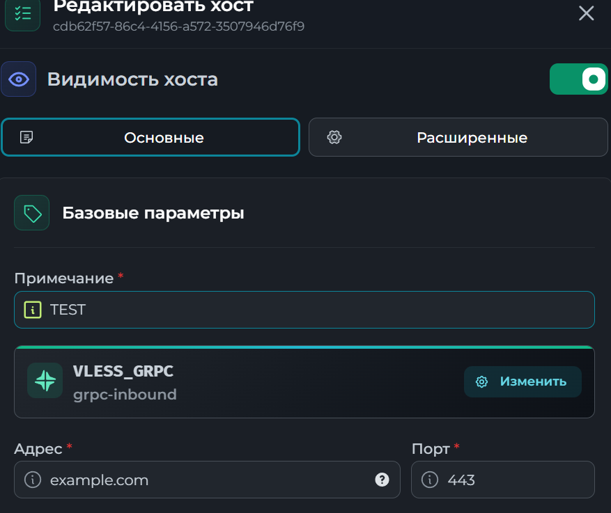
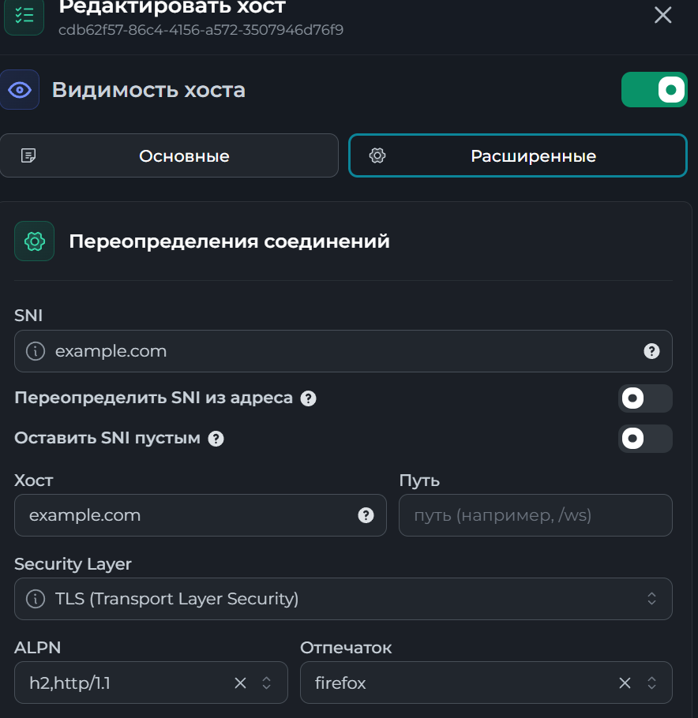

# Remnawave gRPC Direct Kit

Готовый набор для установки gRPC inbound за Nginx TLS reverse proxy.

Схема:

```text
client -> domain:443 TLS/h2 -> nginx -> 127.0.0.1:11443 -> remnanode/xray grpc-inbound
```

## Что внутри

```text
docs/
  images/
    remnawave-host-basic.png
    remnawave-host-advanced.png
  TROUBLESHOOTING.md
scripts/
  install-remna-grpc.sh
README.md
```

## Требования

- Ubuntu 24.04 или близкая версия Ubuntu/Debian.
- Root-доступ.
- Домен с A-записью на IP сервера.
- Свободные порты `80` и `443`.
- Remnawave/remnanode уже должен быть установлен отдельно, если ты будешь сразу назначать профиль на node.

## Быстрый старт

### Через Git

1. Склонируй репозиторий на сервер:

```bash
git clone https://github.com/NikitaAzmov/GRPC.git
cd GRPC
```

2. Запусти меню:

```bash
chmod +x scripts/install-remna-grpc.sh
sudo ./scripts/install-remna-grpc.sh
```

Откроется:

```text
========================
       AZMOV PANEL
========================
1. GRPC SETUP
2. INDEX HTML CONCEPT
3. OPTIMIZATION
0. EXIT
```

### Одной командой с GitHub

Интерактивный запуск меню:

```bash
sudo bash -c 'tmp="$(mktemp)"; curl -fsSL https://raw.githubusercontent.com/NikitaAzmov/GRPC/main/scripts/install-remna-grpc.sh -o "$tmp" && chmod +x "$tmp" && "$tmp"'
```

Если хочешь сначала посмотреть скрипт:

```bash
curl -fsSL https://raw.githubusercontent.com/NikitaAzmov/GRPC/main/scripts/install-remna-grpc.sh -o install-remna-grpc.sh
nano install-remna-grpc.sh
sudo bash install-remna-grpc.sh
```

### Из архива/папки

1. Скопируй папку проекта на сервер.

2. Перейди в папку:

```bash
cd GRPC
```

3. Запусти меню:

```bash
chmod +x scripts/install-remna-grpc.sh
sudo ./scripts/install-remna-grpc.sh
```

4. Выбери `1. GRPC SETUP`. Скрипт спросит:

```text
Optimize node network settings? BBR, buffers, fq, optional MTU
Interface MTU
Domain pointed to this server
Email for Let's Encrypt
Remnawave Panel public IP allowed to Node API
Remnawave Node API port
gRPC serviceName
Index HTML concept 1-5
```

Оптимизация включает BBR, `fq`, TCP buffers, `tcp_fastopen`, `tcp_mtu_probing`, `txqueuelen 5000` и опциональный MTU. Рекомендуемый MTU по умолчанию: `1476`.

`Remnawave Node API port` обычно `2222`. Этот порт нужен Panel, чтобы видеть node и отправлять config profile.

Рекомендуемый `gRPC serviceName`:

```text
media.session.poll
```

5. После завершения проверь сайт:

```bash
curl -I https://your-domain.example/
curl https://your-domain.example/health
```

Ожидаемый health-ответ:

```json
{"status":"ok"}
```

В конце установки скрипт сам выведет статистику:

- путь к логу установки;
- публичный IP;
- DNS через `1.1.1.1` и `8.8.8.8`;
- HTTP-код сайта;
- ответ `/health`;
- слушающие порты `443`, `11443`, Node API port;
- параметры Host для Remnawave.

## Настройка Remnawave

В Remnawave добавь новый Config Profile и вставь JSON:

```json
{
  "log": {
    "loglevel": "warning"
  },
  "dns": {
    "servers": [
      {
        "address": "https://dns.google/dns-query",
        "skipFallback": false
      }
    ],
    "queryStrategy": "UseIPv4"
  },
  "inbounds": [
    {
      "tag": "grpc-inbound",
      "port": 11443,
      "listen": "127.0.0.1",
      "protocol": "vless",
      "settings": {
        "clients": [],
        "decryption": "none"
      },
      "sniffing": {
        "enabled": true,
        "destOverride": [
          "http",
          "tls",
          "quic"
        ]
      },
      "streamSettings": {
        "network": "grpc",
        "security": "none",
        "grpcSettings": {
          "multiMode": false,
          "serviceName": "media.session.poll"
        }
      }
    }
  ],
  "outbounds": [
    {
      "tag": "DIRECT",
      "protocol": "freedom"
    },
    {
      "tag": "BLOCK",
      "protocol": "blackhole"
    }
  ],
  "routing": {
    "rules": [
      {
        "ip": [
          "geoip:private"
        ],
        "type": "field",
        "outboundTag": "BLOCK"
      },
      {
        "type": "field",
        "protocol": [
          "bittorrent"
        ],
        "outboundTag": "BLOCK"
      }
    ]
  }
}
```

Главные параметры:

```text
Inbound: grpc-inbound
Listen: 127.0.0.1
Port: 11443
Protocol: vless
Network: gRPC
Security: none
Service Name: media.session.poll
Multi Mode: false
```

Для клиента/host в Remnawave:

```text
Address/SNI/Host: твой домен
Port: 443
Security: TLS
Network: gRPC
Service Name: media.session.poll
Multi Mode: false
ALPN: h2,http/1.1
Fingerprint: chrome
```

Отпечаток (`Fingerprint`) можно использовать разный: `chrome`, `firefox`, `safari` и другие варианты, которые поддерживает клиент. Универсального лучшего значения нет, его нужно тестировать под конкретного клиента, провайдера и маршрут. Если один fingerprint дает высокий ping, нестабильность или плохой connect, попробуй другой.

Пример базовых настроек Host:



Пример расширенных настроек Host:



Если меняешь `serviceName` при установке, обязательно поменяй его и в JSON Config Profile.

## Что делает скрипт

- Проверяет, что запуск идет от root.
- Проверяет публичный IP и DNS A-запись домена через `1.1.1.1` и `8.8.8.8`.
- Ждет освобождения `apt`/`dpkg` lock, если работает `unattended-upgrades`.
- Устанавливает `nginx`, `certbot`, `ufw`, `dnsutils` и базовые утилиты.
- Устанавливает Docker, если его нет.
- Настраивает системные лимиты и TCP-параметры.
- По желанию включает сетевую оптимизацию: BBR, `fq`, TCP buffers, `tcp_mtu_probing`, MTU.
- Открывает в UFW только `22`, `80`, `443`.
- Если указан IP панели и Node API port, открывает Node API port только для IP панели.
- Получает Let's Encrypt сертификат через standalone certbot.
- Создает decoy-сайт и `/health`.
- Позволяет выбрать один из 5 разных Index HTML concepts.
- Настраивает Nginx с TLS HTTP/2 и gRPC proxy на `127.0.0.1:11443`.
- Сохраняет итоговый Remnawave/Xray profile в `/root/remnawave-grpc-config-profile.json`.

## Index HTML Concepts

Пункт меню `2. INDEX HTML CONCEPT` позволяет сменить заглушку без переустановки gRPC:

```text
1. Edge Media Monitor - light SaaS status
2. Northstar Observatory - dark space telemetry
3. Casa Verde - Italian cafe
4. Sakura Dispatch - Japanese logistics
5. Nordic Weather Grid - minimal weather
```

После выбора концепт пишется в `/var/www/decoy` и Nginx перезагружается.

## Optimization Menu

Пункт меню `3. OPTIMIZATION`:

```text
1. Default balanced (recommended, MTU 1476)
2. Low latency (lighter buffers, MTU 1476)
3. High throughput (larger buffers, MTU 1476)
4. Custom MTU only
5. Disable persistent MTU service
```

## Проверка после назначения профиля

После назначения profile на node:

```bash
docker restart remnanode
sleep 10
ss -lntp | grep -E ':(11443|443)\b'
```

Должно быть:

- `nginx` слушает `443`;
- inbound слушает `127.0.0.1:11443`.

Логи Nginx:

```bash
journalctl -u nginx -n 100 --no-pager
tail -n 100 /var/log/nginx/error.log
tail -n 100 /var/log/nginx/grpc_access.log
```

Логи remnanode:

```bash
docker logs remnanode --tail 100
```

Проверка сетевой оптимизации:

```bash
sysctl net.ipv4.tcp_congestion_control
sysctl net.core.default_qdisc
sysctl net.ipv4.tcp_mtu_probing
ip link show ens3
tc qdisc show dev ens3
```

Если MTU `1476` на конкретном провайдере работает хуже, временно верни `1500`:

```bash
ip link set dev ens3 mtu 1500
systemctl disable --now remnawave-network-optimize.service
```

## Если Remnawave Panel не видит Node

Для клиентского gRPC нужен `443`, но для связи Panel -> remnanode нужен отдельный `NODE_PORT` из `docker-compose.yml` remnanode, часто это `2222`.

Если при установке ты пропустил IP панели или порт, открой его только для IP панели:

```bash
sudo ./scripts/open-remnanode-api.sh
```

Или вручную:

```bash
ufw allow from PANEL_IP to any port NODE_API_PORT proto tcp
ufw reload
```

Проверь на node:

```bash
ss -lntp | grep ':2222'
docker logs remnanode --tail 100
ufw status verbose
```

Проверь с сервера панели:

```bash
nc -vz NODE_PUBLIC_IP 2222
```

## Важно

Не открывай Node API port на весь интернет. Безопаснее разрешить доступ только с публичного IP Remnawave Panel:

```bash
ufw allow from PANEL_IP to any port NODE_API_PORT proto tcp
```

Например:

```bash
ufw allow from 81.29.146.164 to any port 2222 proto tcp
```

Если Node API у тебя уже настроен отдельно, этот kit его не трогает.
